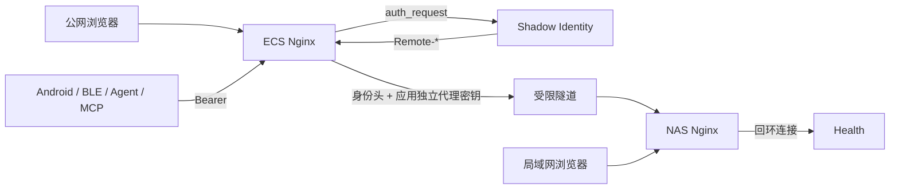

# Health SSO 改造记录

本文记录 Health 已完成的 Shadow Identity 接入，供维护、排障和回滚使用，不是新项目接入
模板。后续项目统一采用应用内原生 OIDC，不再复制 Health 的 Forward Auth / Hybrid 方案。

文中的域名、地址、端口、账号和路径均为示例；实际配置只保存在仓库外。

## 1. 改造范围

这次只改浏览器认证与入口安全边界：

- 公网浏览器由 Shadow Identity 完成登录和准入组判断；
- NAS 内网入口继续保留 Health 原有本地登录；
- Android 同步、BLE、Agent、MCP 和提醒接口继续使用原 Bearer；
- 数据库、业务权限、餐照目录、LLM 和 Agent 协议没有迁移；
- 公网域名根路径与 NAS `/shealth/` 子路径由代理层映射。

因此，SSO 故障不会要求迁移或回滚业务数据。

## 2. 当前链路



ECS 负责 TLS、Identity 子请求、浏览器路径保护和机器路径分流；NAS Nginx 负责子路径映射
并从回环访问 Health；应用最终决定代理身份是否可信。

## 3. 应用改造

### 3.1 三种运行模式

`app/config.py` 支持：

| `SHADOW_AUTH_MODE` | 行为 |
|---|---|
| `local` | 只使用 Health 原有本地登录 |
| `hybrid` | 可信代理身份优先，否则回退本地登录 |
| `forward-auth` | 只接受可信代理身份，不开放本地登录 |

当前既有部署使用 Hybrid。这个模式只为 Health 保留，后续项目不实现这三态兼容层。

Hybrid 启动时强制要求：

- `SESSION_SECRET` 至少 32 字符；
- `AUTH_PASSWORD_HASH` 已配置；
- 代理身份密钥至少 32 字符；
- 至少一个允许组；
- 可信代理值全部是合法 CIDR。

### 3.2 本地会话

`app/auth.py` 将原进程内随机会话改为 HMAC 签名 Cookie，包含版本、签发时间、随机 nonce
和签名。这样重启和多 worker 后仍可验证，并拒绝过期、未来时间、格式错误和签名篡改。

Cookie 仍是 Health 本地会话，不等同于 Identity 会话。退出时删除本站 Cookie；全局退出
使用配置的 Identity logout URL。

### 3.3 代理身份验证

Health 只有同时满足以下条件才接受 `Remote-*`：

1. 模式不是 `local`；
2. socket peer 位于 `SHADOW_TRUSTED_PROXIES`；
3. `X-Shadow-Proxy-Secret` 与受限文件中的值常量时间匹配；
4. `Remote-User` 非空、长度合法且不含 CR/LF；
5. `Remote-Groups` 至少命中一个允许组。

显示名和邮箱只作为展示属性。任何条件失败都不建立代理身份；Hybrid 回到本地登录，
Forward Auth 返回未认证。

代理密钥只存在于 ECS Nginx 私密 include 与 Health 主机受限文件中，不能写进 `.env` 示例、
Git、镜像、日志或浏览器响应。

## 4. 请求分类

| 请求 | ECS 行为 | Health 鉴权 | 预期失败方式 |
|---|---|---|---|
| 浏览器页面 | Identity `auth_request` | 代理身份或 Hybrid 本地会话 | 302/303 到登录 |
| `/healthz` | 精确旁路 | 无状态存活 | 直接 200/失败 |
| `/readyz` | 不对公网公开 | 数据库就绪检查 | 200 或 503 |
| `/api/ingest/` | 精确旁路 SSO | Health Bearer | 401 JSON |
| `/api/agent/` | 精确旁路 SSO | Health Bearer | 401 JSON |
| `/api/offline/` | 精确旁路 SSO | Health Bearer | 401 JSON |
| `/api/reminders/` | 精确旁路 SSO | Health Bearer | 401 JSON |

机器 location 必须清空 `Remote-*` 和 `X-Shadow-Proxy-Secret`。不能旁路整个 `/api/`，否则
以后新增的浏览器 API 会自动绕过 SSO。

## 5. 多跳代理安全边界

Health 根据真实 TCP 对端判断代理是否可信，不根据 `X-Forwarded-For`。原生 uvicorn 启动
命令必须保留：

```bash
uvicorn app.main:app --host 127.0.0.1 --port 8080 --no-proxy-headers
```

若允许 uvicorn 用代理头改写 `request.client`，隧道或外部地址会替代 NAS Nginx 的真实回环
对端，导致身份误判。正确做法是保留真实对端，不是把隧道源、容器网段或
`0.0.0.0/0` 加入可信代理。

客户端 IP 只用于 Nginx 访问日志；它不参与代理身份信任。

## 6. 双入口与子路径

NAS 入口带 `/shealth/`，公网入口映射为域名根路径。NAS Nginx 根据入口设置前缀信息，ECS
额外传递 `X-Shadow-External-Root`，应用统一生成页面、静态资源和重定向 URL。

不要给 uvicorn 固定单一 `root_path`，因为同一进程需要同时服务有前缀和无前缀入口。
Android 保存完整 Base URL，所有 API 和 WebView 路径都在该地址上拼接。

## 7. 部署顺序

维护或重建当前链路时按以下顺序：

1. 备份两端 Nginx、服务管理配置和 Health `.env`；
2. 部署 Identity，并先验证配置、数据库、会话存储和自身健康检查；
3. 生成应用独立代理密钥，通过受限文件分别安装到两端；
4. Health 先以 `local` 启动并验证 `healthz`、`readyz` 和 Bearer 接口；
5. 安装 NAS 子路径代理，确认回环对端和 `--no-proxy-headers`；
6. 安装 ECS 证书、Identity 子请求和精确 location 分流；
7. Health 切到 `hybrid`，执行完整验收；
8. 完成证书模拟续期，保存脱敏状态码和配置哈希。

Nginx 每次都先 `nginx -t` 再 reload。HTTP 站点必须为 ACME challenge 保留 Webroot，不能
在 server 顶层无条件跳转而截断续期验证。

## 8. 验收清单

- [ ] 公网未登录页面跳转 Identity，登录后回到原页面；
- [ ] 无准入组用户不能进入；
- [ ] 内网本地登录仍可使用；
- [ ] 伪造 `Remote-*`、错误密钥、错误来源和错误组均不能建立身份；
- [ ] 正确来源、密钥和组可以建立身份；
- [ ] 四类机器接口缺 Bearer 返回 401，不发生 SSO 302；
- [ ] 正确 Bearer 的 Android、BLE、Agent、MCP 与提醒协议无变化；
- [ ] `/healthz` 不访问数据库，数据库异常时 `/readyz` 返回 503；
- [ ] 公网根路径和 NAS 子路径的静态资源、跳转与 Cookie 正确；
- [ ] Identity、Health、Nginx、隧道和证书定时器重启后恢复正常；
- [ ] 日志不含密码、Token、Cookie、代理密钥或完整身份头。

## 9. 常见故障

| 现象 | 优先检查 |
|---|---|
| 登录后循环跳转 | 准入组、Remote-User、代理密钥、Cookie Path |
| 正确登录仍回本地登录 | socket peer 是否被代理头改写、可信 CIDR是否精确 |
| 机器接口收到 302 | location 是否误套浏览器 `auth_request` |
| 内网链接跳到公网根路径 | 外部前缀和 `X-Shadow-External-Root` 是否混用 |
| 证书续期失败 | HTTP ACME location 是否先于 HTTPS 跳转 |
| 重启后本地会话失效 | `SESSION_SECRET` 是否稳定挂载且权限正确 |

## 10. 回滚

当前 Health 的回滚目标是恢复本地登录，不改业务数据：

1. 公网入口停止转发或恢复上一份已验证配置；
2. `SHADOW_AUTH_MODE` 切回 `local`；
3. 重启 Health，验证内网登录、Bearer、`healthz` 和 `readyz`；
4. 保留 Identity 数据和代理密钥文件供排障，不临时公开应用端口；
5. 修复后从代理身份负向测试重新验收。

## 11. 后续边界

Health 现有 Hybrid 不继续抽象成共享 SDK，也不要求其他项目兼容本地登录。若未来决定把
Health 改成原生 OIDC，应作为独立改造移除 Forward Auth，而不是再增加第四种认证模式。

其他项目直接遵循 Shadow Platform 的 `docs/app-integration.md` 和 `docs/migration.md`。
