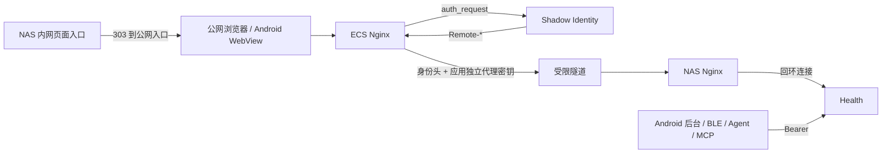

# Health SSO 接入记录

本文记录 Health 当前使用的 Shadow Identity Forward Auth 接入，供维护、排障和回滚使用。
Health 已移除本地密码、Hybrid 模式和应用本地会话。后续项目遵循 Shadow Platform 的原生
OIDC 规范，不复制本方案。

仓库中的域名、地址、端口和账号均为示例；真实配置只保存在仓库外。

## 1. 当前边界

- 所有浏览器页面只接受 Shadow Identity 身份；
- NAS 内网旧入口不再显示密码页，自动交接到公网 HTTPS SSO 入口；
- Android 同步、BLE、Agent、MCP 和提醒继续使用原 Bearer；
- 数据库、业务权限、餐照、LLM 与 Agent 协议没有变化；
- 公网根路径与 NAS `/shealth/` 子路径由代理层映射。



## 2. 应用认证

Health 仅接受同时满足以下条件的代理身份：

1. TCP 对端位于 `SHADOW_TRUSTED_PROXIES`；
2. `X-Shadow-Proxy-Secret` 与受限文件常量时间匹配；
3. `Remote-User` 非空、长度合法且不含 CR/LF；
4. `Remote-Groups` 命中至少一个允许组。

显示名和邮箱只作为展示属性。任何条件失败都不会建立身份，也不会回退到密码或 Cookie。
受保护页面先重定向应用内 `/login`，该路由只负责跳到 `SHADOW_SSO_ENTRY_URL`，用于兼容
现有 NAS 书签和仍以局域网地址为首选的 Android 配置。

已删除并不再读取：

- `AUTH_PASSWORD_HASH`；
- `SESSION_SECRET`；
- `SHADOW_AUTH_MODE`；
- `SHADOW_COOKIE_SECURE`；
- 旧 `sh_session` Cookie 与 `/login` 密码表单。

## 3. 请求分类

| 请求 | ECS 行为 | Health 鉴权 | 失败方式 |
|---|---|---|---|
| 浏览器页面 | Identity `auth_request` | 可信代理身份 | 交接到 SSO |
| `/healthz` | 精确旁路 | 无状态存活 | 200/连接失败 |
| `/readyz` | 不公开 | 数据库就绪检查 | 200/503 |
| `/api/ingest/` | 精确旁路 SSO | Health Bearer | 401 JSON |
| `/api/agent/` | 精确旁路 SSO | Health Bearer | 401 JSON |
| `/api/offline/` | 精确旁路 SSO | Health Bearer | 401 JSON |
| `/api/reminders/` | 精确旁路 SSO | Health Bearer | 401 JSON |

机器 location 必须清空 `Remote-*` 与 `X-Shadow-Proxy-Secret`。不能旁路整个 `/api/`。

## 4. 多跳代理安全边界

Health 根据真实 TCP 对端判断代理是否可信，不使用 `X-Forwarded-For`。原生 uvicorn 必须：

```bash
uvicorn app.main:app --host 127.0.0.1 --port 8080 --no-proxy-headers
```

不要把隧道来源、容器网段或 `0.0.0.0/0` 加入可信代理。代理密钥只存在于 ECS Nginx
私密 include 与 NAS 受限文件中，不写 Git、镜像、日志或浏览器响应。

## 5. 部署切换

1. 备份两端 Nginx、Supervisor 和 Health `.env`；
2. 确认 Identity、公网入口、代理密钥和准入组均可用；
3. 在 `.env` 增加 `SHADOW_SSO_ENTRY_URL`，删除四项旧认证配置；
4. 拉取移除本地认证的版本并重启 Health；
5. 验证公网登录、NAS 内网跳转、Android WebView 与四类机器接口；
6. 确认旧密码 POST 返回 405，旧 Cookie 无法建立身份。

Nginx 每次先 `nginx -t` 再 reload。应用端口保持回环绑定。

## 6. 验收

- [ ] 公网未登录完成 Identity 登录并回到 Health；
- [ ] 无准入组用户不能进入；
- [ ] 内网页面跳转公网 SSO，不出现旧密码表单；
- [ ] 伪造身份头、错误密钥、错误来源和错误组均失败；
- [ ] 四类机器接口缺 Bearer 返回 401，不发生 SSO 302；
- [ ] 正确 Bearer 的 Android、BLE、Agent、MCP 与提醒协议无变化；
- [ ] `/healthz` 不访问数据库，`/readyz` 能反映数据库故障；
- [ ] 日志不含密码、Token、Cookie、代理密钥或完整身份头。

## 7. 回滚

回滚只恢复上一完整发布，不在当前版本重新开启密码入口：

1. 停止放量并恢复上一版应用与对应 Nginx 配置；
2. 验证旧版本关键路径和机器 Bearer；
3. 修复后重新执行代理身份负向测试与完整验收；
4. 不扩大可信代理、不公开应用端口、不把密钥临时写入仓库。

若未来把 Health 改成原生 OIDC，应作为独立迁移替换 Forward Auth，而不是再增加兼容模式。
